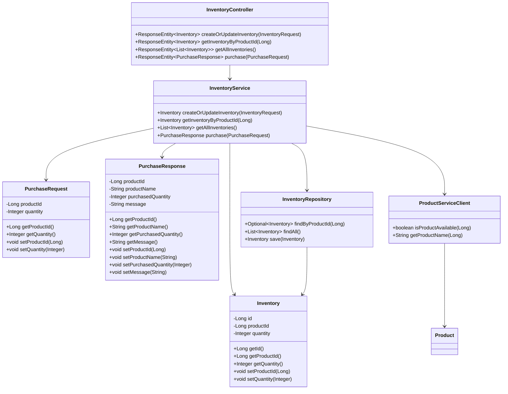

# 📦 Inventory Service

[](https://www.oracle.com/java/technologies/javase/jdk17-archive-downloads.html)
[](https://spring.io/projects/spring-boot)
[](https://www.sqlite.org/)
[](https://jsonapi.org/)

## 📋 Descripción

Microservicio encargado de la gestión del inventario de productos. Permite consultar, actualizar el stock y procesar compras. Se comunica con el `Product Service` para validar la existencia y obtener información de los productos. Expone una API RESTful siguiendo el estándar JSON:API.

## 🛠️ Tecnologías y Dependencias Clave

- **Spring Boot 3.5.3**
- **Spring Data JPA**: Para la persistencia de datos del inventario.
- **Spring Web**: Para la creación de endpoints REST.
- **Spring WebFlux (WebClient)**: Para realizar llamadas HTTP reactivas al `Product Service`.
- **Spring Validation**: Para validación de datos de entrada.
- **SQLite JDBC Driver**: Driver para la base de datos SQLite.
- **SpringDoc OpenAPI (Swagger UI)**: Documentación interactiva de la API.
- **Spring Boot Actuator**: Endpoints de salud y monitoreo.
- **Lombok**: Reducción de código boilerplate.
- **JUnit & Spring Boot Test**: Framework de pruebas.

## ⚙️ Configuración

- **Puerto**: `8082`
- **Context Path**: `/api`
- **API Key**: Configurada en `application.yml` bajo `security.api-key`. Valor por defecto: `INVENTORY_SERVICE_KEY`.
- **URL del Product Service**: Configurada en `application.yml` bajo `product.service.url`. Valor por defecto: `http://localhost:8081/products`.
- **API Key del Product Service**: Configurada en `application.yml` bajo `product.service.api-key`. Valor por defecto: `PRODUCT_SERVICE_KEY`.
- **Base de Datos**:
    - **SQLite (Local/Test)**: Se crea un archivo `inventory.db` en el directorio de ejecución.
## 📐 Diagrama

## 🚀 Instrucciones de Ejecución

### 🐳 Con Docker

Este servicio se ejecuta como parte del `docker-compose.yml` principal. Para ejecutarlo de forma aislada:

```bash
# Desde el directorio raíz del proyecto
docker-compose up --build inventory-service
```
### 🧪 Local con Maven
Requiere Java 17 y Maven instalados. Asegúrese de que el Product Service esté en ejecución.
```bash
/mvnw spring-boot:run
```
El servicio estará disponible en http://localhost:8082/api.

Documentación de la API (Swagger UI): http://localhost:8082/api/swagger-ui.html

📡 Endpoints
Todos los endpoints requieren la cabecera X-API-KEY con el valor de la API Key configurada.

GET /api/inventory/{productId}
Consulta la cantidad disponible de un producto específico.

Respuesta (JSON:API - Éxito):
```bash
{
    "data": {
        "id": 1,
        "productId": 1,
        "quantity": 134
    },
    "errors": null
}
```
Respuesta (Error - Inventario no encontrado):
```bash
{
    "data": null,
    "errors": [
        {
            "detail": "Inventory not found for product ID: 18",
            "title": "Inventory Not Found",
            "status": "404"
        }
    ]
}
```
POST /api/inventory
Actualiza (o crea) la cantidad de stock para un producto.

Cuerpo de la Solicitud:
```bash
{
    "productId": 1,
    "quantity": 150
}
```
Respuesta (JSON:API - Éxito):
```bash
{
    "data": {
        "id": 1,
        "productId": 1,
        "quantity": 150
    },
    "errors": null
}
```
Respuesta (Error - Validación):
```bash
{
    "data": null,
    "errors": [
        {
            "detail": "Product with ID 50 does not exist in the product service",
            "title": "Internal Server Error",
            "status": "500"
        }
    ]
}
```
POST /api/inventory/purchase
Procesa una compra de un producto.

Cuerpo de la Solicitud:
```bash
{
    "productId": 12,
    "quantity": 11
}
```
Respuesta (JSON:API - Éxito):
```bash
{
    "data": {
        "productId": 12,
        "productName": "Tablet 10 pulgadas",
        "purchasedQuantity": 11,
        "message": "Purchase successful. 11 units of 'Tablet 10 pulgadas' purchased."
    },
    "errors": null
}
```
Respuesta (Error - Producto no encontrado):
```bash
{
    "data": null,
    "errors": [
        {
            "detail": "Product with ID 50 does not exist",
            "title": "Internal Server Error",
            "status": "500"
        }
    ]
}
```
Respuesta (Error - Stock insuficiente):
```bash
{
    "data": null,
    "errors": [
        {
            "detail": "Insufficient inventory for product ID: 1. Available: 150, Requested: 500",
            "title": "Insufficient Inventory",
            "status": "400"
        }
    ]
}
```
## 🔗 Comunicación con Product Service
Este servicio se comunica con el Product Service mediante WebClient para verificar la existencia de un producto y obtener su nombre antes de realizar operaciones de inventario o compras. Utiliza la API Key configurada para autenticarse con el servicio externo.

## 🧪 Pruebas
Las pruebas unitarias y de integración se encuentran en src/test. Se utilizan mocks para simular el Product Service.

Para ejecutar las pruebas:
```bash
./mvnw test
```
## 📄 Licencia
Este proyecto está licenciado bajo la Licencia "".

